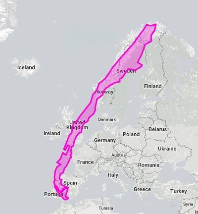
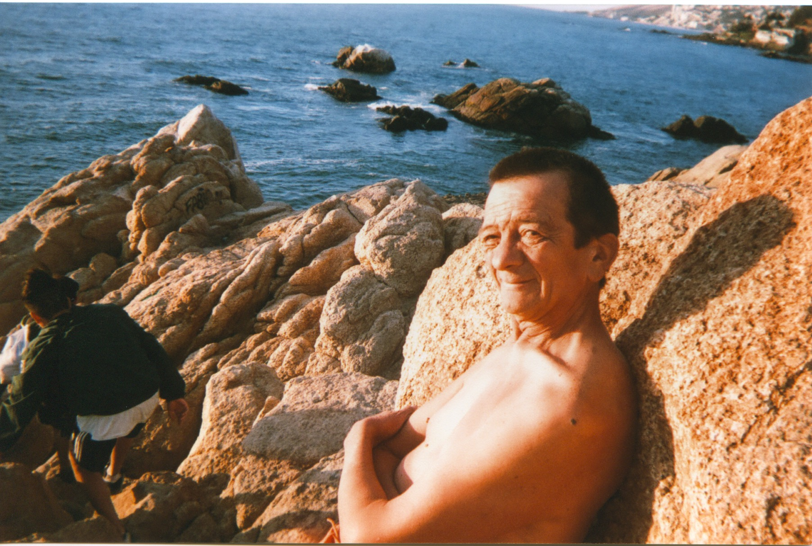

I spent 5 months in Valparaíso and Viña del Mar, Chile, an hour and a half from the capital of Santiago.

I allowed myself only 1 photo a day, taken with a disposable camera.

Here are the photos I liked the most with commentary sprinkled throughout. Any external photo links are not my own. All except one are from Chile. Experienced way more than I can fit in a single post, so this will mostly be about the photos.

I would walk the streets of the Valparaíso’s hills as far I could alone before I started reaching areas that my outsider status might have brought unwanted attention. While walking I’d use a little self aware humor to get direct answers: “Para un gringo como yo, cuantas cuadras más puedo caminar sin problemas?” (For a gringo like me, how many more blocks can I walk without problems?). I’d often be told a range, “about 3-4 more blocks”. I’d stop at 3 and ask my friends about the rest.

> Photo walking after taking an ‘[ascensor](https://upload.wikimedia.org/wikipedia/commons/3/32/Ascensor_Artiller%C3%ADa.jpg)‘ (elevator) in Valparaíso.

La Plaza Aníbal Pinto. Lots of people selling souvenirs, jewelry, and “yerba” on the side. She was selling stenciled art and caught my eye.

I was living in Viña del Mar with a Chilean family. Below was the view above the metro station which made going between the two cities a breeze. My informal education on some of the darker elements of Chile’s history began in the neighborhood I was living in. I met many people that were deeply affected by the [1973 coup](https://en.wikipedia.org/wiki/1973_Chilean_coup_d'%C3%A9tat) that led to the dictatorship of Augusto Pinochet until 1990. Many fled abroad (often to Europe to escape [Operation Condor](https://en.wikipedia.org/wiki/Operation_Condor)) while those who stayed suffered directly and indirectly from repression, torture, and ‘dissapearing’.

That was the past. Though some of that trauma seemed to often manifest itself in a form of political apathy, not out of ignorance, but a kind of cautious preference to enjoy time spent together. This attitude lead me to an initial kind of culture shock, I had to practice unlearning the “go go go productivity” mindset I internalized in the United States.

So, the Chilean ocean gave me lots of opportunities to take breaks and appreciate the ebb and flow of it all ([the voice of crashing waves](https://www.youtube.com/watch?v=KDrRS9f5ryM) at one of Pablo Nerdua’s houses).

Before we talk food, let’s get down with some generalized history first.

Chile is super separated from the rest of the countries in the area because North = Desert, East = Mountains, South = Patagonia + Antarctica, West = Atlantic Ocean, so its cultural developed far from other factors that shaped say, Argentina, Colombia or Peru. Here are two images from [truesizeof.com](https://thetruesize.com/) that give context to the actual size of Chile

(1) compared to the US

(2) and Europe

Astonishing how long and thin the country is, yeah? This constricts transportation infrastructure as well,  so due to this and other factors, most Chileans live in central Chile (Santiago alone hosts more than 40% of the country’s population). Valparaíso used to be a primary port city in South America before the US did some political strong arming to get a controlled shortcut via the Panama Canal. In the past, travelers and merchants (and many still), primarily British and Germans, began stopping at the city for supplies, etc while circumnavigating South America and as a result many decided to settle.

Now that we have some context… Food and Drink, Bullet Edition™
- • [Image Search Overiew](https://www.google.cl/search?espv=2&tbm=isch&sa=1&btnG=Buscar&q=tipica+comida+chilena#imgrc=_)
- • PERUVIAN/JAPANESE SUSHI FUSION is super popular here, at least in part due to the previous waves of Peruvian immigrants, many who assimilated through their gastronomy. Almost every few corners in some commercial and residential districts there is a sushi restaurant that offers moped delivery. Peruvians are also responsible for importing this dish, [lomo a lo pobre](https://en.wikipedia.org/wiki/Lomo_a_lo_pobre#/media/File:Lomo_a_lo_pobre_Oct_29_2011_Santiago_Chile.jpg), which is now a Chilean staple.
- • BREAD EVERYWHERE. Rice is less popular than bread by a long shot. They love bread and fresh marmalade, meats, German sausage, and more bread to wipe your plate clean. I experienced carbohydrate-fueld weight when I arrived, but eventually limited my bread time to the daily meal gathering Chileans call “once” (spanish for “eleven”), even though it happens around 8pm. In practice it’s a late night bread and tea time you have oddly enough given the title, around 8pm.
- • STREET STAPLES. First, a street food you can’t walk a few blocks without spotting someone desperately trying to eat without spilling on themselves. Its a lunchtime favorite, and makes plenty of nighttime appearances after people exhaust themselves dancing till 3am. [Meet the completo](https://www.elblogdeviajes.com/wp-content/uploads/2012/09/completo.jpg) = hotdog + avocado (called “palta” here because the local indigenous word is different than what US residents are accustomed to: avocado coming from the Spanish aguacate, from the Nahuatl word used by Aztecs in precolonial Mexico) + tomato + last but certainly most in quantity, mayonnaise.
- • BLAND FOOD, NEVER SPICY. Very few exceptions. Things labeled ‘spicy’ will dissapoint anyone spoiled with readily available Indian, Mexican, and Thai food. From personally getting burned repeatedly, I must warn that any food labeled Mexican in Chile is a tourist trap and will let you down. It was the first thing I wanted to eat when returning to the US.
- • SEAFOOD. Fresh seafood everywhere along the coast! To me initially, a strange food I have never encountered in the US was Piure. It tastes relatively bitter but is absolutely delicious when thrown in bowl with salt, lime, minced onion, and cilantro.
- • ALCOHOL. Pisco is king. Pisco sour is common novelty, but the average Chilean night out opted for Pisco and Coke. There is some light feuding between Chile and Peru as to who makes the better Pisco – never noticed much of a difference. Wine is delicious here, but Chile exports over 75% of the wine it produces so if you’re into wine and live outside of the country you can definitely get some easily. Given the German influence, German style beer is also popular. Without looking up statistics I’d say pisco and beer are by far the most consumed, while wine is reserved for special occasions.
- • TEA AND COFFEE. Among the British influence, many Chileans prefer tea to coffee. The distribution of wealth has a larger divide than in the US, despite being a relatively wealthy country. So, despite the prevalence of booshie cafés, many Chileans opt to drink instant coffee, Nescafe being the dominant name in this market. My Chilean friend Carlos poked fun at the brand: “Nescafe? No es Café”. Talking mate , you’d be hard pressed to find someone in central Chile that regularly drinks it, but in southern Chile it’s a staple. The southern people of Argentina and Chile seemed less preoccupied with the politics of their national northern capitals, a kind of culturally unity of the people of Patagonia, with the rivalry between their countries being a theme of distant urban bureaucrats.

This was taken a short walk from a hostel I stayed at in Coyhaique (a large capital city of the south). The statue behind him is of a giant hand holding mate.

From north to south, Chile has a rich history involving fisherman. I was walking around [Caleta Portales](http://dandolelavueltaalmundo.org/wp-content/uploads/2016/10/Caleta-portales.jpg) during a holiday that celebrates a saint the fisherman have traditionally looked to for protection. There were vendors and groups with organized music and dancing all day and night. The owner of a small boat (green jersey) spotted me with a camera and offered to give me a free ride on their boat as long as I promised to take a photo and put it online.

We boated along the coast towards Viña del Mar, and would occasionally stop parallel to other small boats. They’d pass beers back and forth while chatting for a bit and blasting music.

The coast was a wonderful place to walk, especially when there weren’t special events going on. Curious what might lay at the northern end of the [Playa del Deporte](https://media.biobiochile.cl/wp-content/uploads/2015/12/a_uno_356371.jpg)…

Reaching the end of the beach, I climbed some glass-littered rockface and met Luis. He was a local newspaper vendor who lived further inland. He came to the same spot every Sunday to watch the sunset. As the sun began to dip beneath the ocean, I joked about me getting too old, so he told me a motivational story he read in the paper about a young kid [taking action to clean up the ocean](https://www.mnn.com/earth-matters/wilderness-resources/blogs/remember-kid-who-invented-way-clean-ocean-plastic-hes-back-and-its-happening).

This is Reñaca, north of Viña del Mar. Some Chileans referred to it as “cuico/a”, a derogatory way to refer to rich people that are pretentious or snobby. Nice beaches.

Out-of-towner capturing an out-of-towner. (Viña del Mar)

Selfie.

Two punky youths I wanted to learn more about while they were hanging in the streets of “Valpo”. His flashy Sailor Moon shoot caught my attention, but in the moment snapped too early. They both were from Brazil, and getting by while as street vendors while traveling around.

They had a boombox so I couldn’t resist, we rapped in Spanglish for a bit before the metro arrived.

Renovating a house in the eastern hills of Viña del Mar. Didn’t talk to him as much as I would have liked to, I was in a hurry to catch a bus.

Outside and inside “la casa central” of [PUCV](http://pucv.cl/).

Lima, Peru. Bought some juice. Spilled it on myself a block later.

I hope I’ll return someday to experience another Chilean sunset.

Maybe to visit those I came to love.

Maybe for another calling.

Maybe for a different photo compilation in Santiago?

[return home](https://coreyhodge.net)