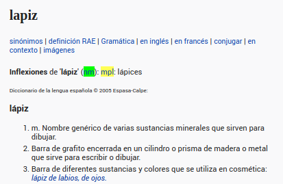
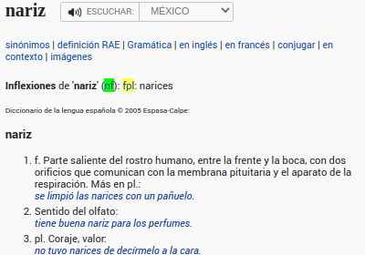
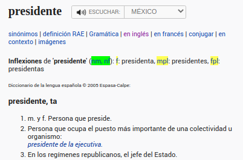

For my most recent project, [Spanish Diminutive Generator](https://github.com/WordsPerMinute/spanish-diminutive-generator), I tried to find an appropriate API. Although, my vision was bigger than my budget. Sometimes in development life, you might have to get scrappy and start web scraping. Since this is a personal project, I felt comfortable with this route because I won't be driving an unfair amount of traffic towards the source.

How does the app work? Input a word and get its Spanish diminutive, along with a photo.  
```
    casa => casita  
    café => cafecito  
    pantelón => panteloncito  

```


For the scope of this post, the need for the scraper isn't related to the images, but rather the words themselves.

In order to properly generate the diminutive form of the word entered, the algorithm needs to know the word's gender. In Spanish, there are two genders: masculine and feminine (whereas some languages, like German, has a neuter gender for a total of 3 genders). Usually, you can tell the gender of a Spanish word by its ending. Does it end in 'a'? It's feminine. What about 'o'? Masculine.

However, some words have the same ending letter but different genders. For example, 'lapiz' (pencil) is masculine, while 'nariz' (nose) is feminine. This means that my algorithm should turn 'lapiz' into 'lapicito' and 'nariz' into 'naricita'.

How will the algorithm know a word's gender? Again, no appropriate API was within the budget.  I knew this app's bandwidth wouldn't cause any problems for the recipient (otherwise scraping might be less than honorable), so it felt okay to implement this solution.

This is where I decided to enlist the help of my favorite dictionary, [www.wordreference.com](https://www.wordreference.com/) and a library called cheerio. After reading the basics via [Scraping data in 3 minutes with Javascript](https://medium.com/data-scraper-tips-tricks/scraping-data-with-javascript-in-3-minutes-8a7cf8275b31) and [cheerio](https://cheerio.js.org/)-[repo](https://github.com/cheeriojs/cheerio), I was ready to go.

First, I pick a word and head to 'https://www.wordreference.com/definicion/WORD-GOES-HERE', which makes it easy to string interpolate later. Below, the images show the exact CSS class I need (highlighted in green) to get the element that tells me the words gender. Yellow is also targeted by this CSS class, but I'm using '.first()' to isolate it. If the text content 'nm' (nombre masculino), the noun is male. If it's 'nf' (nombre feminino), the noun is female.



  

```
 

    // import cheerio
    const cheerio = require('cheerio');

    const response = await fetch(`https://www.wordreference.com/definicion/${word}`)
        let htmlText = await response.text();

        // this turns page's text into html you can run queries on
        let $ = cheerio.load(htmlText);

        // targets the aforementioned CSS class, it's value should be saved as 'nm' or 'nf'
        let genderInfo = $(.POS2').first().text()

```

The function eventually looks at index 1 of the string I'm getting back ('nm' gives me 'm', and 'nf' gives me 'f'). At this point, the scraper is mostly working BUT there's a problem. The  scraper is telling me the word 'amiga' is masculine. How could that be!?



As seen above, if the word can be BOTH masculine and feminine, such as 'el presidente/la presidente' or 'el amigo/la amiga', that same class selector I used before is returning a 6 character string 'nm, nf' instead of the 2 character I was expecting. What's one possible way to handle this?  


```
 

    if (genderInfo.length > 2) {
        switch(word[word.length - 1]) {
            case 'o':
                break;
            case 'e':
                break;
            default:
                isFeminine = true;
        }
    } else {
        if ($('strong+ .POS2').text()[1] === 'f') {isFeminine = true}
    }
 
```

This works based on two important pieces of information - the actual word the user is passing, and the length of the string we scrape.

In if statement (the word has multiple gender possibilities), all we need to do is check the end of the word being passed. If the user passed 'amigo', they are intending for the masculine word, so we don't set isFeminine to true. If the user passed 'amiga', then neither of the first two cases would trigger, and so isFeminine would be set to true. (The generator currently doesn't accept definite articles, such as with 'el presidente' or 'la presidente', preceding a word - it would simply default to masculine until this is fixed.) If it's 2 characters, we know it's ONLY a masculine or feminine word, and we can check index 1 of the string in order to know which.

This scraper function allows me to verify the gender of a word a users passes before throwing it into a much larger conversion algorithm.

That's the basics of a web scraper!

[return to blog](/blog)  
or  
[return home](/)