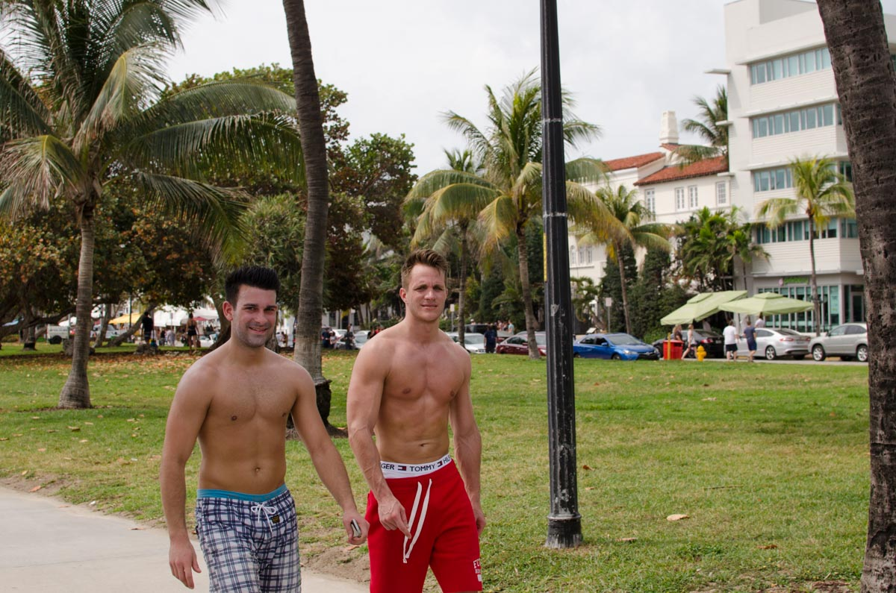
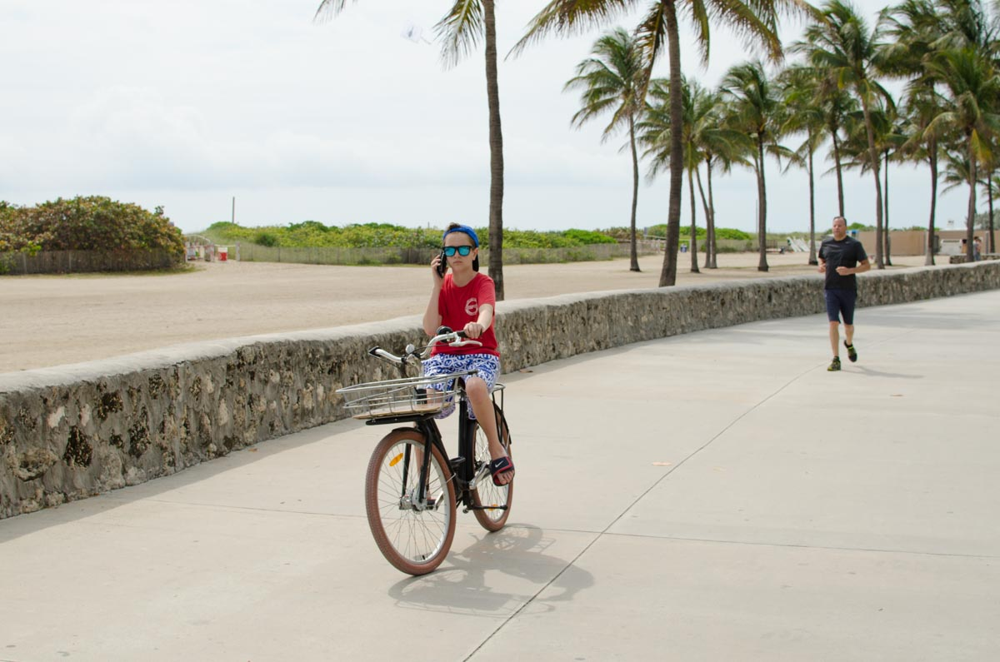
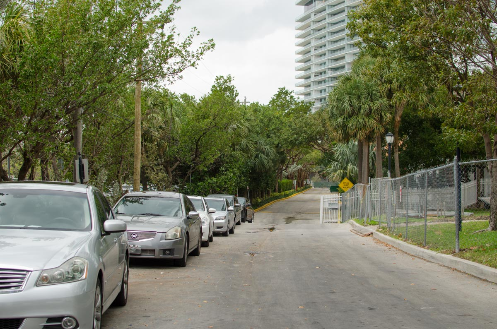
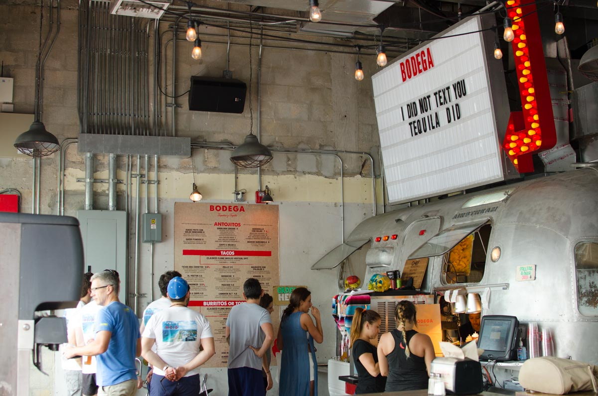

Photowalking in Miami. 2016. Digital with a 35mm lens, 1.5 crop sensor.

Before this trip, I always approached people and asked first before snapping their photo. It was a nice way to get to know someone beforehand. However, a disadvantage to that is it's very difficult to get candid, 'a day in the life of' kind of shots. In Miami, I experimented more with snapping as I walked to capture what I was unfolding around me.

[return to blog](/blog)  
or  
[return home](/)